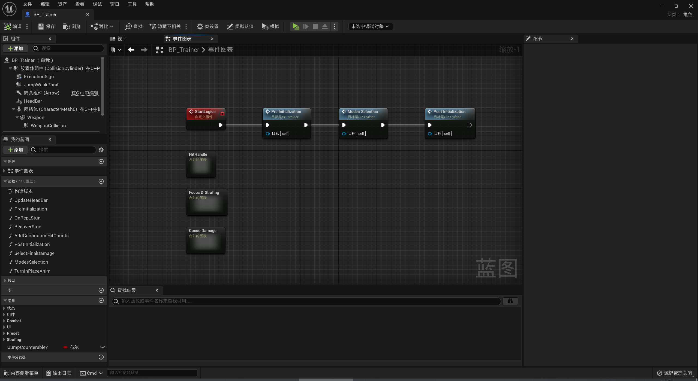
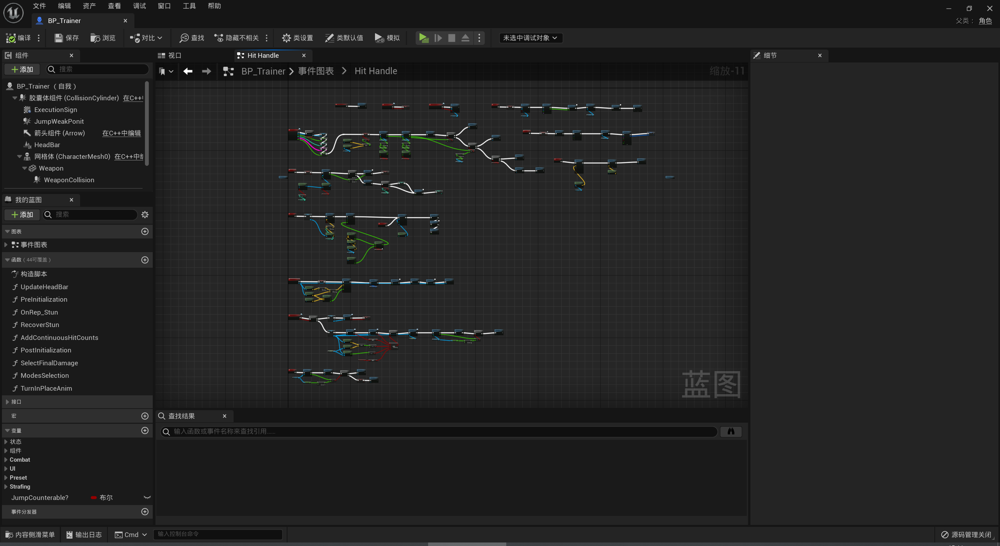
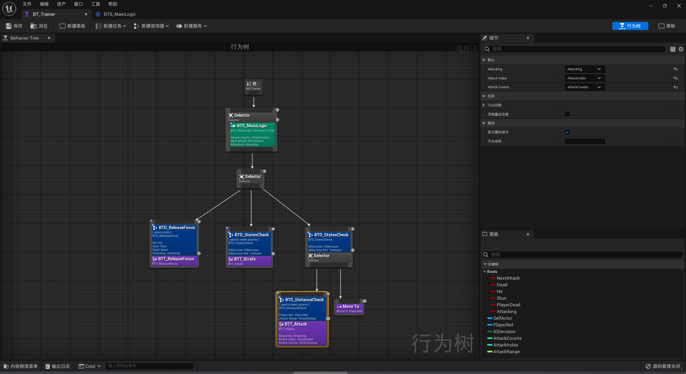
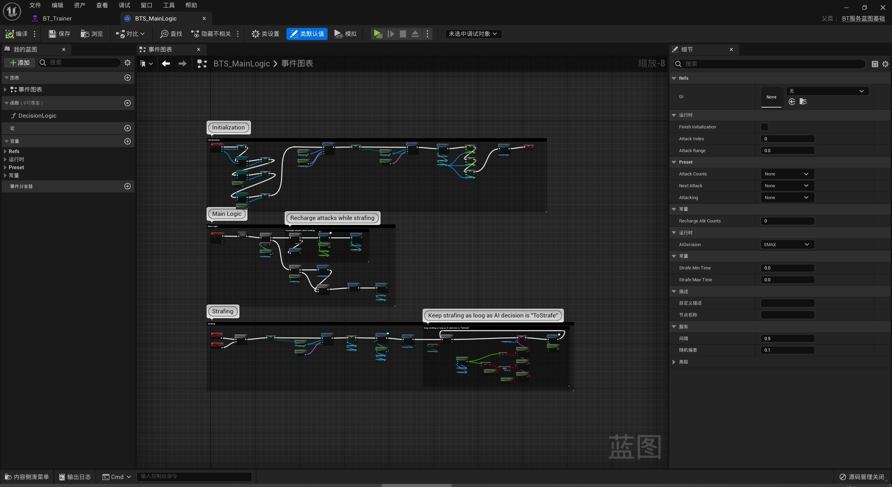

# Combat Demo
基于UE5实现的类只狼战斗Demo

已实现的功能点如下说明：
1. 玩家的主要行为，如locomotion、全方向翻滚、锁定敌人、血量架势逻辑、受击处理、防御招架、攻击连招、位移击退、处决动画和摄像机移动等。
2. 使用行为树设置敌人的各种行为，包括转身、索敌、徘徊、受击、霸体、被处决和各种只狼类型攻击（危、突刺、下段斩）等。

**游戏截图**

**敌人蓝图**

**敌人AI行为树**

